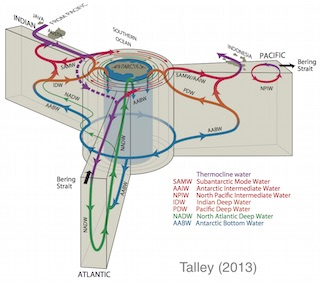
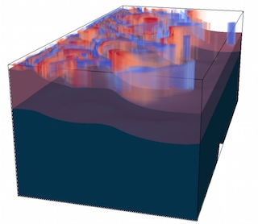
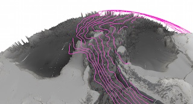
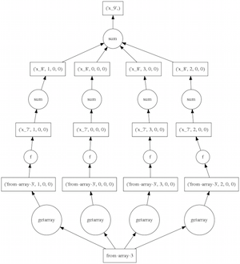

# Research

## Ocean Circulation and Mixing

   

An intricate network of currents circulates water through the global ocean. This circulation is important for Earth's climate because it transports heat, salt, and dissolved chemicals (such as carbon and oxygen) from the surface, where they are in contact with the atmosphere, to the deep abyss, where they can be isolated and stored for centuries or more. One of our main goals is to understand what controls the strength and structure of this global circulation.

## Mesoscale Dynamics

On scales of 10-500 km, the ocean is a twisted tangle of eddies, filaments, and fronts. The behavior of these turbulent flows is dynamically similar to weather systems of the atmosphere. The complexity of the ocean mesoscale is a central focus of our research. We are trying to understand how energy flows through the mesoscale, the rates at which mesoscale eddies mix the ocean, and how mesoscale transport processes influence climate and ocean biology. Better understanding of the mesoscale transport processes will lead to better representation of sub-grid mixing in climate models.

## Southern Ocean and Climate

The Southern Ocean surrounds Antarctica and connects the other three major ocean basins (Atlantic, Pacific, and Indian). It is the home to the world's strongest current, the Antarctic Circumpolar Current, and is full of mesoscale eddies. Because so much water comes together here, the Southern Ocean is central to the global circulation, but the intense mesoscale turbulence (and a historical lack of observations), make it very challenging to understand the flow. Improved understanding of the drivers of Southern Ocean circulation will help improve future climate predictions and will also shed light on past climates, such as glacial cycles.

## Big Data Analysis

Scientific datasets are growing in size at an exponential rate, and oceanographic data is no exception. New high-resolution satellite observations and autonomous observing platforms are producing data faster than we can analyze it. Global eddy-resolving ocean models in particular can easily generate terabytes and petabytes of data. Our usual data analysis tools break down when confronted with these data volumes. We am actively engaged in developing open-source software tools to overcome this barrier and enable our community to efficiently process oceanographic Big Data.
